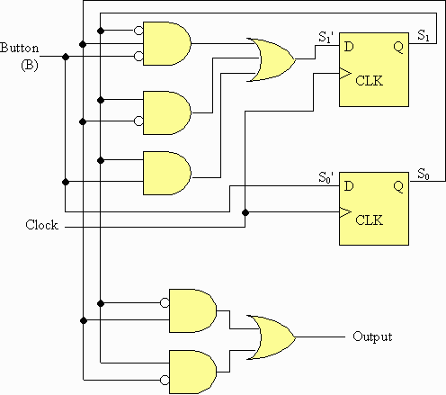

= Finite Automata to Digital Circuit Synthesizer
:icons: image
:icontype: svg
:customcss: style.css
// :revealjsdir: https://cdn.jsdelivr.net/npm/reveal.js@3.9.2
:revealjs_hash: true
:title-slide-background-image: ./images/background-circuit.svg
:title-slide-background-opacity: 0.25

== Members
* 1902085 Dheeraj Lalwani
* 1902086 Chirag Lulla
* 1902168 Kartik Soneji
* 1902184 Aayush Wadhwani

Group Number: 24 +
Guide: Prof. Sakshi Surve

== Abstract
[text-justify]
* Finite Automata are fundamental concepts in Automata Theory and Digital Logic Design.
* These FA can be converted into a circuit.
* Given an FA transition table as input, this project aims to generate the equivalent transition logic with primitive/basic gates/components.

== Application
[.text-justify]
Finite Automata can be used to break down a circuit's function into a collection of states and rules which determine when the system moves from one state to another state.
The state diagram consists of nodes which represent the states and arrows (sometimes called edges) which give the possible transitions between states.

[transition=zoom]
== Example

=== Finite Automata

[mermaid.finite-automata, format=svg, theme=dark, background=0000000, opts=inline, align=center]
----
stateDiagram-v2
	direction LR
	
	a: A. Bulb off
	b: B. Bulb on
	c: C. Bulb on
	d: D. Bulb off
	
	[*] --> a
	
	a --> a : 0
	a --> b : 1
	
	b --> c : 0
	b --> b : 1
	
	c --> c : 0
	c --> d : 1
	
	d --> a : 0
	d --> d : 1
----

=== Transition Table

[cols="3*^"]
|===
| State | `button not pushed (0)` | `button pushed (1)`

| `A`  | `A`                      | `B`
| `B`  | `C`                      | `B`
| `C`  | `C`                      | `D`
| `D`  | `A`                      | `D`
|===

=== Circuit

== Technologies
* icon:javascript[] JavaScript
* icon:typescript[] TypeScript

== References

. R. Jagielski. "Visual simulation of finite state machines" sci-hub.se
. https://faculty.etsu.edu/tarnoff/ntes2150/statemac/statemac.htm
. https://ivanzuzak.info/noam/webapps/fsm_simulator/
. https://github.com/izuzak/noam
. https://github.com/CircuitVerse/CircuitVerse/wiki/GSoC%2721-Project-List#project-6---fsm-to-circuit-synthesizer
